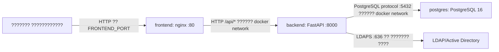

# Parking Booking Service

?????? ???????????? ??????????? ???? ??? ???????????, ?????????? ? ??????????????.
?????? ????????? ?? Docker-?????????????: frontend ???????? nginx, backend ???????? ?? FastAPI, ?????? ???????? ? PostgreSQL, ????? ? ?????? ??????????? ?????? ????? LDAPS.

## ?????? ???????

- `frontend/` ? React/Vite SPA: ????????????, ?????????????????, ??????????.
- `backend/` ? FastAPI REST API: ??????-???????, JWT-??????, ????, PostgreSQL, LDAPS.
- `docker-compose.yml` ? ?????? `postgres`, `backend`, `frontend`.
- `.env.example` ? ?????? production-????????.

## ????? ??????????????



## ??????? ? ?????

| ?????? | ?????? ?????????? | ??????? ????? | ?????????? |
|---|---:|---:|---|
| `frontend` | `80/tcp` | `${FRONTEND_BIND_IP}:${FRONTEND_PORT}` | nginx, SPA, proxy `/api` ? backend |
| `backend` | `8000/tcp` | ?? ??????????? | REST API, JWT, ??????? ???????????? |
| `postgres` | `5432/tcp` | ?? ??????????? | ?????????? ?? ?????????? |
| LDAPS | ?????? `636/tcp` | ??????? ????? `LDAP_URL` | ???????? ?????? ? ?????? |

?????????? ???? backend `8000` ?? ??????????? ? ?????? `8000` ?? ???????, ?????? ??? ?????? ?? ??????????????.
PostgreSQL ???? ?? ??????????? ??????, ? ???? ?????????? ?????? backend ?? ????? Docker-??????? `postgres`.

## ???????? ??????

???????? ?? ? PostgreSQL ? named volume `postgres_data`, ???? ?????? ?????????? PostgreSQL: `/var/lib/postgresql/data`.
???? `backend/parking.db` ?? ???????????? ??? production-????????? ? ????? ???? ?????? ????????? ?????????? ?????? ??????????.

Backend ??????? ??????? ????? SQLAlchemy ??? ??????. ??????????? ??????? ???????? ???? ???, ??????? ????????? ????????? ?? ? ??????? ????? ??????????? ????????.

## ??????????? ? ????

LDAPS ? ???????????? ?????? ???????? ?????? ? ??????. ????????? ???????? ?????? ? ?? ?????? ???.

??????? ?????:

1. Frontend ?????????? `POST /api/auth/login`.
2. Nginx ?????????? ?????? ? backend `/auth/login`.
3. Backend ???? ???????????? ? LDAP/AD ????? `LDAP_BIND_DN` ? `LDAP_USER_SEARCH_BASE`.
4. Backend ????????? ?????? ????????? bind-?? ?????????? DN.
5. Backend ??????? ??? ????????? ????????? ?????? `users` ? PostgreSQL.
6. Backend ?????? JWT.

???? ?? ??????? ?? LDAP-?????. ???? ???????? ??????? ? ??????? ? ???????? ???????? ? PostgreSQL ? ??????? `users`.

???? LDAP-???????????? ?????? ??????? ? ??? ??? ??? ? ????????? ???????, backend ??????? ??? ? ????? `employee` ? `active=true`. ????? ????? ????????????? ????? ??????? ???????? ???? ??? ????????? ????????????.

????? ?????? ????????????? ???? ????? ? ?????? ??, ? `.env` ????? ??????? `INITIAL_ADMIN_USERNAMES`. ??? ???? ??? ????????? LDAP-??????? ????? ???????. ??? ?????? backend ??????? ??? ??? ????????? ?????? ? ????? `admin`, ?? ?????? ??? ????? ????? ??????????? ?????? ????? LDAPS.

## ????

- `employee` ? ????????? ????????? ???? ???????? ????? ?? ???????, ? ????? 18:00 ????? ?? ????????? ??????? ????.
- `manager` ? ???????? ????????? ? ?????? ??????? ??? ????????? ??????, ????? ????? ????????? ???????????????? ??????.
- `admin` ? ????????????? ????????? ??????????????, ??????, ???????????, ???????, ??????????????, ??????????? ? ???????????.

## ???????? API

| ????? | ???? | ?????????? |
|---|---|---|
| `GET` | `/health` | healthcheck backend ? ????????? ?? |
| `POST` | `/auth/login` | ???? ????? LDAPS, ?????? JWT |
| `GET` | `/auth/me` | ??????? ???????????? |
| `GET` | `/spots` | ?????? ???? |
| `GET` | `/availability?start=YYYY-MM-DD&end=YYYY-MM-DD` | ????????? ? ??????? ????? |
| `GET` | `/bookings/my` | ???????????? ???????? ???????????? |
| `POST` | `/bookings` | ??????? ???????????? |
| `DELETE` | `/bookings/{id}` | ??????? ????? |
| `GET` | `/users` | ????????????, ?????? admin |
| `POST` | `/users` | ??????? ????????? ??????? ????????????, ?????? admin |
| `PATCH` | `/users/{id}` | ???????? ????/??????????/??? ????????????, ?????? admin |
| `GET/PATCH` | `/booking-settings` | ?????????/?????????? ????????????, ?????? admin |

## ?????????? ?????????

| ?????????? | ??????????? | ?????? | ?????????? |
|---|---|---|---|
| `FRONTEND_BIND_IP` | ??? | `0.0.0.0` | IP ?????????? frontend |
| `FRONTEND_PORT` | ??? | `8081` | ??????? ???? frontend |
| `CORS_ORIGINS` | ??? | `http://10.0.0.5:8081` | ??????????? origin ??? ??????? API-??????? |
| `APP_TIME_ZONE` | ??? | `Europe/Moscow` | ??????? ???? ??????-?????? |
| `SECRET_KEY` | ?? | `openssl rand -hex 32` | ??????? JWT |
| `POSTGRES_DB` | ??? | `parking` | ??? ?? |
| `POSTGRES_USER` | ??? | `parking` | ???????????? ?? |
| `POSTGRES_PASSWORD` | ?? | ??????? ?????? | ?????? PostgreSQL |
| `INITIAL_ADMIN_USERNAMES` | ?? | `ivanov,petrov` | LDAP-?????? ????????? ??????? |
| `LDAP_URL` | ?? | `ldaps://dc01.example.local:636` | ????? LDAP/AD |
| `LDAP_BIND_DN` | ?? | `CN=parking-bind,...` | ????????? ??????? ?????? ?????? |
| `LDAP_BIND_PASSWORD` | ?? | ?????? | ?????? ????????? ??????? ?????? |
| `LDAP_USER_SEARCH_BASE` | ?? | `OU=Users,DC=example,DC=local` | ???? ?????? ????????????? |
| `LDAP_USER_FILTER` | ??? | `(sAMAccountName={username})` | ?????? ?????? ???????????? |
| `LDAP_USER_FULL_NAME_ATTRIBUTE` | ??? | `displayName` | ??????? ??? |
| `LDAP_TLS_VALIDATE` | ??? | `true` | ???????? ??????????? LDAPS |
| `LDAP_CA_CERT_FILE` | ??? | `/certs/root-ca.pem` | ???? ? ?????????????? CA ?????? backend-?????????? |
| `LDAP_CONNECT_TIMEOUT` | ??? | `5` | ??????? LDAP-?????????? |

## ?????? ??????

```bash
cp .env.example .env
nano .env
```

?????????? ????????:

- `SECRET_KEY`
- `POSTGRES_PASSWORD`
- `INITIAL_ADMIN_USERNAMES`
- `LDAP_URL`
- `LDAP_BIND_DN`
- `LDAP_BIND_PASSWORD`
- `LDAP_USER_SEARCH_BASE`
- `FRONTEND_PORT`, ???? ????? ?? `8080`

??????:

```bash
docker compose up -d --build
```

????????:

```bash
docker compose ps
curl -I http://127.0.0.1:${FRONTEND_PORT:-8080}/health
curl http://127.0.0.1:${FRONTEND_PORT:-8080}/api/health
```

???????? ?????? ???? `running` ??? `healthy` ? `postgres`, `backend`, `frontend`.

## ????????? ??????????? PostgreSQL

```bash
mkdir -p backups
docker compose exec -T postgres pg_dump -U "$POSTGRES_USER" -d "$POSTGRES_DB" > backups/parking-$(date +%F-%H%M%S).sql
```

??????????????:

```bash
docker compose exec -T postgres psql -U "$POSTGRES_USER" -d "$POSTGRES_DB" < backups/<backup-file>.sql
```

## ??????????

```bash
git pull
docker compose up -d --build
```

?????? ?????????? ??? ????:

```bash
docker compose build --no-cache --progress=plain
docker compose up -d
```

## ?????????

??? ???????? ??????:

```bash
docker compose down
```

? ????????? PostgreSQL volume ? ???? ??????:

```bash
docker compose down -v
```

## ????? backend

```bash
cd backend
python -m pip install -r requirements.txt
python -m unittest test_booking_rules.py
```

## ???????????????? ?????????

- ?? ????????? `.env`, ????? ??, backup-????? ? ???????? ???????.
- `SECRET_KEY` ?????? ???? ??????????; ??? ????? ????? ?????? JWT ?????? ?????????????????.
- ????????? ?????? backup PostgreSQL volume.
- ??? LDAPS ????????????? `LDAP_TLS_VALIDATE=true`.
- ???? ???????????? ????????????? CA, ???????? ?????????? ? backend-????????? ? ??????? ???? ? `LDAP_CA_CERT_FILE`.
